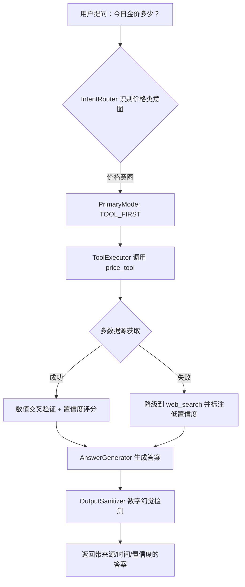
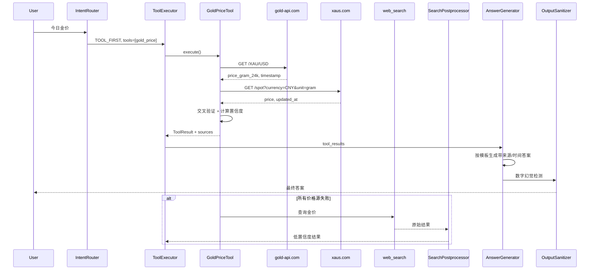
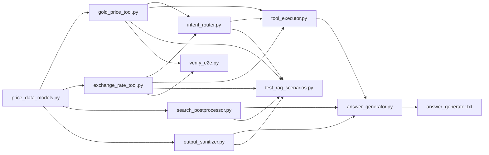

# 价格类实时数据可信度提升技术设计文档

> 目标：解决金价、银价、汇率、股价等数值型实时查询结果不准或完全错误的问题，提升系统对数值型实时查询的可信度。
>
> 版本：v1.0
> 日期：2026-06-27
> 状态：已实施（垂类结构化工具落地于 `backend/src/tools/`：金价/汇率/天气/时间）
> 适用项目：c:\MyCode\langchain_rag_demo

---

## 1. 需求梳理（Requirement Organization）

### 1.1 业务背景

项目已有一套基于 **LangChain + FastAPI + Vue3** 的 RAG 问答系统，近期完成工具平台化改造，核心模块包括：

- `BaseTool` / `ToolRegistry` / `ToolManager`
- `IntentRouter`（意图路由）
- `ToolExecutor`（工具执行器）
- `AnswerGenerator`（答案生成器）
- `SearchPostprocessor`（搜索后处理）
- `OutputSanitizer`（输出清洗）
- `TraceCollector`（链路追踪）

用户反馈：询问"今日金价"时，模型回复"今日金价：4067.98 元/克"，数值明显错误。根本原因是通用 web search 结果质量不可控，模型容易产生数字幻觉。

### 1.2 核心问题

| 问题类型 | 具体表现 | 影响 |
|---------|---------|------|
| 搜索结果污染 | 搜索结果中混杂过时、错误、营销页面 | 模型引用错误数据 |
| 模型数字幻觉 | LLM 在无权威来源时编造数值 | 用户得到完全错误的价格 |
| 缺少权威数据源 | 无专门的金/银/汇率/股价 API | 依赖低质量网页文本 |
| 缺少时间/来源标注 | 模型不说明数据何时来自何处 | 用户无法判断可信度 |
| 缺少置信度评估 | 系统无法识别低置信度答案 | 不会主动提示用户核实 |

### 1.3 目标范围

**本次覆盖的查询类型**：

- 贵金属价格：金价、银价、铂金、钯金
- 汇率：美元兑人民币、欧元、日元、港币等常见货币对
- 股价：常见股票实时/近期价格（可选扩展）

**本次不覆盖**（避免过度设计）：

- 加密货币实时价格（波动过大、数据源稳定性差）
- 大宗商品期货（需要更专业的数据许可）
- 个性化投资组合计算（超出"价格查询"范畴）

### 1.4 非功能性需求

- 仅使用离线开源模型，不使用付费大模型 API。
- 数据源 API 必须免费；若需 API Key，必须是用户可选配置，不影响基础运行。
- 工具必须继承 `BaseTool` 并注册到 `ToolManager`。
- 所有新增 Python 文件必须包含中文/英文 docstring。
- 后端保持 FastAPI + SQLAlchemy 2.0 async + Python 3.10+。
- 前端仅在必要时增加显示字段，本次以 API 层优化为主。

---

## 2. 技术选型（Technology Selection）

### 2.1 总体思路

采用"**垂直工具优先 + 数值交叉验证 + 来源强制标注 + 低置信度兜底**"的策略：

1. 对价格类查询，不再直接走通用 web search，而是优先调用专用价格工具。
2. 工具内部实现多数据源 fallback，优先使用免费无需 Key 的 API。
3. 对工具返回的数值进行交叉验证和置信度评分。
4. 答案生成阶段强制要求标注数据来源和时间。
5. 输出清洗阶段增加数字幻觉检测，拦截模型编造数值。

### 2.2 数据源选型对比

#### 2.2.1 金价数据源

| 数据源 | 是否免费 | 是否需要 Key | 免费额度 | 数据更新频率 | 优点 | 缺点 | 推荐级别 |
|-------|---------|------------|---------|------------|------|------|---------|
| **gold-api.com** | 是 | 否 | 实时价格无限制 | 实时 | 无需 Key、无限请求、响应快 | 为个人项目，长期稳定性未知 | 首选 |
| **GoldAPI.io** | 是 | 是 | 50 req/月（免费层） | 实时 | 数据专业、支持多货币/克重 | 免费额度极低，需 Key | 备选 |
| **xaus.com** | 是 | 否 | 合理用量无限制 | 30 秒刷新 | 无需 Key、支持 30+ 货币、盎司/克/千克 | 相对较新 | 备选 |
| **aurumrates.com** | 是 | 否（50 req/天）或可选 Key | 50 req/天无 Key | 60 秒 | 支持多商品 | 免费额度有限 | 备选 |
| **metals-api.com** | 是 | 是 | 未明确，通常较低 | 实时 | 数据全面 | 需 Key、免费额度有限 | 不推荐首选 |
| **上海黄金交易所** | 否/非公开 | - | 无稳定公开 API | - | 国内权威 | 无稳定公开免费 API | 可作为网页抓取 fallback（本次不做） |
| **世界黄金协会** | 否 | - | 无实时 API | - | 权威行业数据 | 无免费实时 API | 仅作为信息来源标注 |

**推荐方案**：

- **主数据源**：`gold-api.com`（无需 Key、免费、实时、支持 XAU/USD 及克重转换）
- **次数据源**：`xaus.com`（无需 Key、支持多货币和克/千克单位）
- **付费备选**（用户可选配置）：`GoldAPI.io`，通过 `FREE_GOLD_API_KEY` 配置，当免费源均失败时启用

#### 2.2.2 汇率数据源

| 数据源 | 是否免费 | 是否需要 Key | 免费额度 | 数据更新频率 | 优点 | 缺点 | 推荐级别 |
|-------|---------|------------|---------|------------|------|------|---------|
| **frankfurter.app / api.frankfurter.dev** | 是 | 否 | 无限制（合理用量） | 每日（工作日） | 无需 Key、开源、支持 200+ 货币、可自托管 | 非实时（央行日度参考价） | 首选 |
| **exchangerate-api.com** | 是 | 是 | 1,500 req/月 | 每日 | 额度 generous、文档完善 | 需 Key、免费层非实时 | 次选 |
| **open.er-api.com** | 是 | 否 | 未知 | 每日 | 无需 Key | 货币覆盖较少、稳定性一般 | 备选 |
| **Exchange Rate API (exchange-rateapi.com)** | 是 | 是 | 300 req/月 | 实时（60 秒） | 实时、Reuters 数据源 | 需 Key、免费额度低 | 可选 |

**推荐方案**：

- **主数据源**：`frankfurter.app`（无需 Key、开源、稳定）
- **次数据源**：`exchangerate-api.com`（用户可选配置 `FREE_EXCHANGE_RATE_API_KEY`）
- **fallback**：当汇率 API 不可用时，通过通用 web search 获取并标注低置信度

#### 2.2.3 股价数据源

| 数据源 | 是否免费 | 是否需要 Key | 免费额度 | 数据更新频率 | 优点 | 缺点 | 推荐级别 |
|-------|---------|------------|---------|------------|------|------|---------|
| **Yahoo Finance（yfinance / yahooquery）** | 是 | 否 | 无明确限制 | 15-20 分钟延迟 | 免费、覆盖广、无需 Key | 非官方、接口可能变更 | 首选 |
| **Alpha Vantage** | 是 | 是 | 25 req/天 或 5 req/min | 实时/延迟 | 官方、数据较规范 | 免费额度极低、实时数据需付费 | 备选 |
| **雅虎财经直接 endpoint** | 是 | 否 | 无明确限制 | 实时/延迟 | 免费 | 非官方、稳定性差 | 不推荐 |

**推荐方案**：

- **主数据源**：`yfinance`（Python 库，调用 Yahoo Finance 非官方 API）
- **次数据源**：`Alpha Vantage`（用户可选配置 `ALPHA_VANTAGE_API_KEY`）
- 股价工具作为**可选扩展**，本次先实现基础骨架，默认不启用高频查询

### 2.3 技术选型决策

| 层面 | 选型 | 说明 |
|-----|------|------|
| 价格工具实现 | `httpx` + `asyncio` | 与现有项目一致，保持异步 |
| 数值解析 | `regex` + `decimal.Decimal` | 避免浮点精度问题 |
| 缓存 | Redis / 内存缓存 | 减少外部 API 调用，遵守免费额度 |
| 配置加载 | `pydantic-settings`（已使用） | 新增可选环境变量 |
| 测试 | `pytest` + `respx` / `aioresponses` | mock 外部 HTTP 请求 |

---

## 3. 架构设计（Architecture Design）

### 3.1 整体流程



### 3.2 价格工具调用时序



---

## 4. 模块划分（Module Division）

### 4.1 新增文件

#### 4.1.1 `backend/src/services/tools/plugins/gold_price_tool.py`

**职责**：查询金价、银价等贵金属实时价格。

**核心能力**：

- 支持多数据源：gold-api.com（主）、xaus.com（备）、GoldAPI.io（可选 Key）
- 支持货币转换：USD、CNY、EUR 等
- 支持单位转换：盎司(oz)、克(gram)、千克(kg)
- 返回带置信度的 `ToolResult`

**工具定义**：

```python
class GoldPriceTool(BaseTool):
    name = "gold_price"
    description = (
        "查询黄金、白银等贵金属的实时价格。"
        "当用户询问金价、银价、黄金价格、白银价格等问题时使用此工具。"
    )
    parameters = {
        "type": "object",
        "properties": {
            "metal": {"type": "string", "enum": ["gold", "silver"], "default": "gold"},
            "currency": {"type": "string", "default": "CNY"},
            "unit": {"type": "string", "enum": ["oz", "gram", "kg"], "default": "gram"},
            "question": {"type": "string", "description": "用户原始问题"},
        },
        "required": [],
    }
```

**关键数据结构**：

```python
@dataclass
class PriceDataPoint:
    value: Decimal
    currency: str
    unit: str
    timestamp: Optional[datetime]
    source: str
    source_url: str
    raw_data: Dict[str, Any]

@dataclass
class ValidatedPriceResult:
    value: Decimal
    currency: str
    unit: str
    confidence: float          # 0.0 ~ 1.0
    freshness_score: float     # 时间新鲜度
    authority_score: float     # 来源权威性
    cross_validation_score: float  # 交叉验证一致性
    sources: List[PriceDataPoint]
    fallback_used: bool
    warnings: List[str]
```

#### 4.1.2 `backend/src/services/tools/plugins/exchange_rate_tool.py`

**职责**：查询常见货币对汇率。

**核心能力**：

- 主数据源：frankfurter.app
- 备选数据源：exchangerate-api.com（用户可选 Key）
- 支持 USD/CNY、EUR/CNY、JPY/CNY、HKD/CNY 等常见对
- 返回带时间和来源标注的结果

**工具定义**：

```python
class ExchangeRateTool(BaseTool):
    name = "exchange_rate"
    description = (
        "查询两种货币之间的最新汇率。"
        "当用户询问汇率、兑换、换算等问题时使用此工具。"
    )
    parameters = {
        "type": "object",
        "properties": {
            "from_currency": {"type": "string", "default": "USD"},
            "to_currency": {"type": "string", "default": "CNY"},
            "amount": {"type": "number", "default": 1},
            "question": {"type": "string", "description": "用户原始问题"},
        },
        "required": [],
    }
```

### 4.2 修改文件

#### 4.2.1 `backend/src/services/intent_router.py`

**改动点**：

1. 新增价格类意图识别规则：
   - 关键词匹配：金价、银价、黄金价格、白银价格、金价多少、今日金价
   - 汇率类：汇率、美元兑人民币、1 美元等于多少人民币
   - 股价类：股价、股票价格、某股票代码/名称 + 价格
2. 在 `route()` 中，价格类问题优先返回 `PrimaryMode.TOOL_FIRST`，建议工具为 `gold_price` / `exchange_rate`。
3. 原有 `_REALTIME_KEYWORDS` 已包含"价格"、"金价"、"汇率"、"股价"等，需要细化规则避免全部走 web search。

**新增函数示例**：

```python
@staticmethod
def is_price_question(question: str) -> bool:
    """识别是否为价格类查询。"""
    if not question:
        return False
    q = question.lower()
    price_keywords = {
        "金价", "黄金价格", "白银价格", "银价", "铂金价格", "钯金价格",
        "黄金", "白银",
    }
    return any(kw in q for kw in price_keywords)

@staticmethod
def is_exchange_rate_question(question: str) -> bool:
    """识别是否为汇率类查询。"""
    if not question:
        return False
    q = question.lower()
    rate_keywords = {
        "汇率", "兑换", "换算", "美元兑人民币", "美元等于多少人民币",
        "欧元兑人民币", "日元兑人民币", "港币兑人民币",
    }
    return any(kw in q for kw in rate_keywords)
```

在 `route()` 中增加（放在天气工具之后、计算类之前）：

```python
# 汇率类问题 -> 汇率工具
if self.is_exchange_rate_question(question):
    return IntentDecision(
        needs_realtime=True,
        primary_mode=PrimaryMode.TOOL_FIRST,
        suggested_tools=["exchange_rate"],
        fallback_strategy=FallbackStrategy.WEB_SEARCH,
        reasoning="识别到汇率查询，优先使用汇率工具",
    )

# 贵金属价格类问题 -> 金价工具
if self.is_price_question(question):
    return IntentDecision(
        needs_realtime=True,
        primary_mode=PrimaryMode.TOOL_FIRST,
        suggested_tools=["gold_price"],
        fallback_strategy=FallbackStrategy.WEB_SEARCH,
        reasoning="识别到贵金属价格查询，优先使用金价工具",
    )
```

#### 4.2.2 `backend/src/services/search_postprocessor.py`

**改动点**：

1. 新增价格类搜索结果的数值交叉验证逻辑（在通用搜索结果进入 LLM 前）。
2. 对搜索结果内容中的数值与 tool results 进行对比，标记一致性。
3. 新增 `_DOMAIN_AUTHORITY` 中的贵金属/汇率权威域名：
   - `gold.org`（世界黄金协会）
   - `lbma.org.uk`
   - `sge.com.cn`（上海黄金交易所）
   - `investing.com`
   - `xetra-gold.com`
4. 新增 `_freshness_score` 对小时/分钟级时间信息的识别。

**新增函数示例**：

```python
def cross_validate_numeric(
    self,
    search_results: List[SearchResult],
    tool_results: List[ToolResult],
    tolerance: float = 0.05,
) -> Tuple[List[SearchResult], float]:
    """将搜索结果中的数值与工具结果交叉验证，返回增强结果和一致性分数。"""
    # 1. 从 tool_results 提取标准数值
    # 2. 从 search_results 提取候选数值
    # 3. 计算匹配度
    # 4. 对匹配的结果增加 metadata
```

#### 4.2.3 `backend/src/services/answer_generator.py`

**改动点**：

1. `_build_context()` 中增加对 `ToolResult.sources` 置信度字段的解析。
2. `_build_prompt()` 传入 `confidence` 参数，低置信度时要求 LLM 明确告知用户。
3. `generate()` 和 `generate_stream()` 返回时增加 `confidence` 字段。

**新增参数**：

```python
async def generate(
    self,
    question: str,
    history_context: str = "",
    tool_results: Optional[List[ToolResult]] = None,
    kb_docs: Optional[List[Any]] = None,
    kb_source_metadata: Optional[List[Dict[str, Any]]] = None,
    is_realtime: bool = False,
) -> Tuple[str, List[Dict[str, Any]], float]:
    ...
```

#### 4.2.4 `backend/src/services/output_sanitizer.py`

**改动点**：

1. 新增数字幻觉检测类 `NumericHallucinationDetector`。
2. 从 LLM 输出中提取所有数值，与 tool results / search results 中的数值对比。
3. 若发现答案中的数值与参考数据偏差超过阈值，标记为幻觉并替换为兜底话术。

**核心函数**：

```python
class NumericHallucinationDetector:
    """检测 LLM 输出中的数字是否与参考数据一致。"""

    @staticmethod
    def extract_numbers(text: str) -> List[Dict[str, Any]]:
        """从文本中提取带上下文的数值。"""
        ...

    @staticmethod
    def is_hallucinated(
        answer_numbers: List[Dict[str, Any]],
        reference_numbers: List[Decimal],
        tolerance: float = 0.05,
    ) -> Tuple[bool, List[str]]:
        """判断是否有数值超出参考范围。"""
        ...
```

在 `OutputSanitizer.sanitize()` 中增加可选参数 `reference_numbers`，幻觉检测失败时返回修正后文本。

#### 4.2.5 `backend/src/prompts/answer_generator.txt`

**新增约束**：

```text
7. 如果参考信息包含工具返回的实时价格/汇率数据，必须：
   - 优先使用工具返回的具体数值，禁止自行估算或编造。
   - 在数值后明确标注数据来源和时间，例如"（数据来源：gold-api.com，2026-06-27 14:32 UTC）"。
   - 如果工具返回多个结果且存在差异，说明差异并给出置信度评估。
8. 当置信度低于 0.6 时，不要直接给出具体数值，而是明确告知用户"当前无法获取可靠的实时数据，建议您通过官方渠道核实"。
9. 对于无法验证的数值，使用"据可查数据..."或"可能约为..."等谨慎表述，禁止以绝对语气陈述未验证数字。
```

#### 4.2.6 `backend/tests/evaluation/test_rag_scenarios.py`

**新增测试用例**：

```python
class TestPriceTools:
    @pytest.mark.asyncio
    async def test_gold_price_tool_mock(self):
        """金价工具应能解析 mock 数据并返回带置信度结果。"""
        ...

    @pytest.mark.asyncio
    async def test_exchange_rate_tool_mock(self):
        """汇率工具应能解析 mock 数据。"""
        ...

class TestNumericHallucination:
    def test_detect_hallucinated_number(self):
        """应能识别答案中的幻觉数字。"""
        ...

class TestIntentRouterPrice:
    def test_gold_price_intent(self, router):
        """金价问题应路由到金价工具。"""
        ...

    def test_exchange_rate_intent(self, router):
        """汇率问题应路由到汇率工具。"""
        ...
```

#### 4.2.7 `backend/tests/evaluation/verify_e2e.py`

**新增验证函数**：

```python
async def verify_gold_price():
    """验证金价工具。"""
    ...

async def verify_exchange_rate():
    """验证汇率工具。"""
    ...
```

#### 4.2.8 `docker-compose*.yml` 及 `.env*` 文件

**新增环境变量**（均为可选）：

```bash
# 贵金属价格工具（可选）
FREE_GOLD_API_KEY=                    # GoldAPI.io 免费层 API Key
GOLD_PRICE_CACHE_TTL=300              # 金价缓存 TTL（秒），默认 5 分钟
GOLD_PRICE_PRIMARY_SOURCE=gold-api.com  # 主数据源
GOLD_PRICE_FALLBACK_SOURCES=xaus.com,goldapi.io

# 汇率工具（可选）
FREE_EXCHANGE_RATE_API_KEY=           # exchangerate-api.com 免费层 API Key
EXCHANGE_RATE_CACHE_TTL=3600          # 汇率缓存 TTL（秒），默认 1 小时
EXCHANGE_RATE_PRIMARY_SOURCE=frankfurter.app
EXCHANGE_RATE_FALLBACK_SOURCES=exchangerate-api.com

# 股价工具（可选）
ALPHA_VANTAGE_API_KEY=                # Alpha Vantage 免费层 API Key
STOCK_PRICE_CACHE_TTL=300             # 股价缓存 TTL（秒），默认 5 分钟

# 数字幻觉检测
NUMERIC_HALLUCINATION_TOLERANCE=0.05  # 数值偏差容忍度（默认 5%）
LOW_CONFIDENCE_THRESHOLD=0.6          # 低置信度阈值
```

---

## 5. 接口与数据结构（Interface & Data Structure）

### 5.1 ToolResult 扩展

现有 `ToolResult` 已包含 `sources` 字段，本次在 `sources` 字典中扩展置信度和时间字段：

```python
{
    "url": "https://gold-api.com/XAU/USD",
    "source": "gold-api.com",
    "title": "实时金价",
    "page_content": "...",
    "confidence": 0.92,
    "timestamp": "2026-06-27T14:32:00Z",
    "data_type": "price",
    "unit": "CNY/gram",
    "document_id": "",
    "filename": "gold_price",
    "chunk_index": 0,
    "total_chunks": 1,
}
```

### 5.2 SearchResult 扩展

`SearchResult` 增加 `confidence` 和 `numeric_values` 字段（可选）：

```python
@dataclass
class SearchResult:
    title: str = ""
    url: str = ""
    content: str = ""
    confidence: float = 0.0
    numeric_values: List[Dict[str, Any]] = field(default_factory=list)
```

### 5.3 置信度数据结构

```python
@dataclass
class ConfidenceReport:
    overall: float                    # 综合置信度 0.0 ~ 1.0
    freshness: float                  # 时间新鲜度得分
    authority: float                  # 来源权威性得分
    cross_validation: float           # 数值交叉验证得分
    source_count: int                 # 可用数据源数量
    fallback_used: bool               # 是否使用了 fallback
    warnings: List[str]               # 警告信息

    def is_low_confidence(self, threshold: float = 0.6) -> bool:
        return self.overall < threshold
```

### 5.4 答案模板

**高置信度模板**：

```text
截至 {timestamp}，{metal} 价格为 {value} {currency}/{unit}。
数据来源：{source}。
```

**多源差异模板**：

```text
截至 {timestamp}，{metal} 价格约为 {value} {currency}/{unit}。
不同数据源存在小幅差异：{source_a} 报 {value_a}，{source_b} 报 {value_b}，综合置信度 {confidence}。
数据来源：{sources}。
```

**低置信度模板**：

```text
当前无法获取可靠的实时 {metal} 价格数据（置信度 {confidence}）。
系统最后一次尝试获取数据的时间为 {last_attempt_time}，建议您通过 {official_source} 等官方渠道核实最新价格。
```

---

## 6. 置信度策略（Confidence Strategy）

### 6.1 数值交叉验证算法

```python
def cross_validate_numeric_values(
    values: List[Decimal],
    tolerance: float = 0.05,
) -> Tuple[Decimal, float, List[str]]:
    """对多个数据源返回的数值进行交叉验证。

    Args:
        values: 多个数据源的数值。
        tolerance: 相对偏差容忍度，默认 5%。

    Returns:
        (consensus_value, consistency_score, warnings)
    """
    if not values:
        return Decimal("0"), 0.0, ["无可用数值"]

    if len(values) == 1:
        return values[0], 0.7, ["仅单一数据源"]

    # 使用中位数作为共识值
    sorted_values = sorted(values)
    n = len(sorted_values)
    median = sorted_values[n // 2] if n % 2 else (sorted_values[n // 2 - 1] + sorted_values[n // 2]) / 2

    # 计算每个值与 median 的相对偏差
    deviations = [abs(v - median) / median for v in values]
    max_deviation = max(deviations)

    if max_deviation <= tolerance:
        consistency_score = 1.0 - max_deviation / tolerance * 0.3
    else:
        consistency_score = max(0.0, 0.5 - (max_deviation - tolerance))

    warnings = []
    if max_deviation > tolerance:
        warnings.append(f"数据源偏差过大，最大偏差 {max_deviation:.2%}")

    return median, consistency_score, warnings
```

### 6.2 时间新鲜度评分

```python
def freshness_score(timestamp: Optional[datetime], now: Optional[datetime] = None) -> float:
    """根据数据时间戳计算新鲜度得分。"""
    if timestamp is None:
        return 0.3
    now = now or datetime.utcnow()
    age_seconds = (now - timestamp).total_seconds()

    if age_seconds <= 60:
        return 1.0
    if age_seconds <= 300:
        return 0.9
    if age_seconds <= 900:
        return 0.8
    if age_seconds <= 3600:
        return 0.7
    if age_seconds <= 21600:
        return 0.5
    if age_seconds <= 86400:
        return 0.3
    return 0.1
```

### 6.3 来源权威性评分

| 来源类型 | 权威性得分 |
|---------|-----------|
| 央行/官方交易所（sge.com.cn, lbma.org.uk） | 0.95 |
| 知名金融数据商（gold-api.com, xaus.com, frankfurter.app） | 0.85 |
| 通用财经媒体（investing.com, 新浪财经） | 0.7 |
| 通用搜索引擎结果 | 0.5 |
| 未知/低质量来源 | 0.3 |

### 6.4 综合置信度计算

```python
def compute_overall_confidence(
    consistency_score: float,
    freshness_score: float,
    authority_score: float,
    source_count: int,
    fallback_used: bool,
) -> float:
    """计算综合置信度。"""
    # 权重：交叉验证 0.4 + 新鲜度 0.3 + 权威性 0.2 + 数据源数量 0.1
    count_score = min(1.0, source_count / 2.0)
    base = (
        consistency_score * 0.4
        + freshness_score * 0.3
        + authority_score * 0.2
        + count_score * 0.1
    )
    if fallback_used:
        base *= 0.7
    return round(min(1.0, max(0.0, base)), 2)
```

### 6.5 低置信度阈值与兜底话术

- **低置信度阈值**：默认 `0.6`
- **处理方式**：
  - 置信度 >= 0.6：正常输出数值，强制标注来源和时间。
  - 0.4 <= 置信度 < 0.6：输出数值，但附加"数据可能存在偏差，建议核实"。
  - 置信度 < 0.4：不输出具体数值，使用兜底话术明确告知用户无法获取可靠数据。

---

## 7. 数字幻觉检测算法（Numeric Hallucination Detection）

### 7.1 算法目标

从 LLM 输出中提取数值，并与 tool results / search results 中的参考数值进行对比，识别并拦截模型编造的数值。

### 7.2 数值提取

```python
import re
from decimal import Decimal, InvalidOperation

# 匹配模式：
# - 整数/小数：4067.98、1,234.56、1 234.56
# - 中文数字上下文：约 4068 元/克
# - 货币符号附近：$4067.98、¥4068
_NUMBER_PATTERN = re.compile(
    r"(?:约|大概|大约|约为)?\s*[¥$€£]?\s*([0-9]{1,3}(?:[,\s][0-9]{3})*|[0-9]+)(?:\.[0-9]+)?\s*(?:元|美元|欧元|日元|港元|英镑|元/克|美元/盎司|%/)?",
    re.UNICODE,
)

def extract_numbers(text: str) -> List[Dict[str, Any]]:
    """提取文本中的数值及其上下文。"""
    results = []
    for m in _NUMBER_PATTERN.finditer(text):
        raw = m.group(0)
        num_str = m.group(1).replace(",", "").replace(" ", "")
        try:
            value = Decimal(num_str)
        except InvalidOperation:
            continue
        start = max(0, m.start() - 20)
        end = min(len(text), m.end() + 20)
        context = text[start:end]
        results.append({
            "value": value,
            "raw": raw,
            "context": context,
            "position": m.start(),
        })
    return results
```

### 7.3 幻觉判定

```python
def detect_hallucination(
    answer: str,
    reference_values: List[Decimal],
    tolerance: float = 0.05,
) -> Tuple[bool, List[str]]:
    """检测答案中的数值是否超出参考范围。

    Returns:
        (has_hallucination, warnings)
    """
    if not reference_values:
        # 无参考数据时，若答案出现具体数值，视为潜在幻觉
        numbers = extract_numbers(answer)
        if numbers:
            return True, ["无权威参考数据，但答案包含具体数值"]
        return False, []

    numbers = extract_numbers(answer)
    hallucinated = []

    for num in numbers:
        value = num["value"]
        # 找最近的参考值
        closest = min(reference_values, key=lambda v: abs(v - value))
        deviation = abs(value - closest) / closest if closest != 0 else float("inf")
        if deviation > tolerance:
            hallucinated.append({
                "value": value,
                "closest_reference": closest,
                "deviation": deviation,
                "context": num["context"],
            })

    warnings = [
        f"答案中的数值 {h['value']} 与参考值 {h['closest_reference']} 偏差 {h['deviation']:.2%}"
        for h in hallucinated
    ]
    return bool(hallucinated), warnings
```

### 7.4 修正策略

当检测到幻觉时，不直接删除答案，而是：

1. 在答案末尾追加警告说明。
2. 如果置信度低于阈值，用兜底话术替换整个数值陈述。
3. 将检测结果记录到 `TraceCollector` 中便于后续分析。

---

## 8. 测试方案（Testing Plan）

### 8.1 单元测试

| 测试对象 | 测试内容 | 工具 |
|---------|---------|------|
| `GoldPriceTool` | mock gold-api.com / xaus.com 响应，验证解析、单位转换、置信度计算 | `pytest` + `respx` |
| `ExchangeRateTool` | mock frankfurter.app 响应，验证汇率解析 | `pytest` + `respx` |
| `IntentRouter` | 验证金价/汇率/股价意图路由到 tool_first | `pytest` |
| `SearchPostprocessor` | 验证数值交叉验证、权威域名评分、新鲜度评分 | `pytest` |
| `AnswerGenerator` | 验证低置信度时 LLM prompt 包含兜底约束 | `pytest` + `AsyncMock` |
| `OutputSanitizer` | 验证数字幻觉检测、修正策略 | `pytest` |

### 8.2 端到端测试

在 `verify_e2e.py` 中新增：

```python
async def verify_gold_price():
    tool = GoldPriceTool()
    result = await tool.execute(question="今日金价")
    assert result.success
    assert "元/克" in result.output or "USD/oz" in result.output

async def verify_exchange_rate():
    tool = ExchangeRateTool()
    result = await tool.execute(question="美元兑人民币汇率")
    assert result.success
    assert "USD" in result.output and "CNY" in result.output
```

### 8.3 Mock 外部 API 的方式

使用 `respx` 库（与 `httpx` 配合）：

```python
import respx
from httpx import Response

@respx.mock
def test_gold_price_tool():
    respx.get("https://gold-api.com/XAU/USD").mock(
        return_value=Response(200, json={
            "price_gram_24k": 150.25,
            "timestamp": 1719500000,
        })
    )
    ...
```

或使用 `unittest.mock.patch` 直接 mock `httpx.AsyncClient.get`。

---

## 9. 风险与回退（Risk & Fallback）

### 9.1 外部 API 不可用

| 风险 | 影响 | 回退措施 |
|-----|------|---------|
| 主金价 API 故障 | 无法获取金价 | 切换到备用 API；全部失败则 fallback 到 web search，并标注低置信度 |
| 汇率 API 故障 | 无法获取汇率 | 切换到备用 API；全部失败则 fallback 到 web search |
| 网络超时 | 工具执行失败 | ToolManager 已有 30 秒超时捕获；工具内部设置更短超时（如 5 秒）并快速 fallback |
| API 返回格式变更 | 解析失败 | 增加异常捕获，记录日志，尝试下一个数据源 |
| 免费额度耗尽 | 被限流 | 使用缓存延长有效期；切换数据源；降低请求频率 |

### 9.2 Graceful 降级流程

```mermaid
flowchart TD
    A[调用 price_tool] --> B{主数据源成功?}
    B -->|是| C[使用主数据]
    B -->|否| D{备用数据源成功?}
    D -->|是| E[使用备用数据]
    D -->|否| F{是否启用 web search?}
    F -->|是| G[web_search 查询价格]
    F -->|否| H[返回"无法获取实时数据"]
    G --> I[SearchPostprocessor 低置信度标注]
    I --> J[生成带风险提示的答案]
```

### 9.3 系统稳定性保障

- 工具执行超时设置为 5 秒，避免阻塞整个问答链路。
- 外部 API 错误不抛异常，返回 `success=False` 的 `ToolResult`。
- `ToolExecutor.execute_with_fallback()` 已支持失败时降级到 web search。
- 增加 Prometheus 指标监控价格工具调用成功率和响应时间。

---

## 10. 实施步骤清单与文件依赖关系（Implementation Plan）

### 10.1 实施步骤

| 阶段 | 任务 | 输出文件 | 依赖 |
|-----|------|---------|------|
| 1 | 新增价格数据通用模型和置信度计算工具 | `backend/src/services/tools/price_data_models.py` | 无 |
| 2 | 实现金价工具（含多数据源 fallback） | `backend/src/services/tools/plugins/gold_price_tool.py` | price_data_models |
| 3 | 实现汇率工具（含多数据源 fallback） | `backend/src/services/tools/plugins/exchange_rate_tool.py` | price_data_models |
| 4 | 扩展 IntentRouter 价格类意图识别 | `backend/src/services/intent_router.py` | 无 |
| 5 | 扩展 ToolExecutor 参数构建 | `backend/src/services/tool_executor.py` | intent_router |
| 6 | 增强 SearchPostprocessor 数值交叉验证 | `backend/src/services/search_postprocessor.py` | price_data_models, search_types |
| 7 | 增强 AnswerGenerator 来源/时间标注 | `backend/src/services/answer_generator.py` | tool_manager |
| 8 | 实现数字幻觉检测 | `backend/src/services/output_sanitizer.py` | price_data_models |
| 9 | 更新 answer_generator prompt | `backend/src/prompts/answer_generator.txt` | 无 |
| 10 | 新增/修改单元测试 | `backend/tests/evaluation/test_rag_scenarios.py` | 上述所有模块 |
| 11 | 新增端到端验证 | `backend/tests/evaluation/verify_e2e.py` | 上述所有模块 |
| 12 | 新增环境变量并更新 docker-compose | `.env.example`, `.env.dev`, `.env.prod`, `docker-compose.yml`, `docker-compose.dev.yml` | 无 |
| 13 | 集成测试与文档更新 | `docs/design/price-trustworthiness.md`（本文档） | 无 |

### 10.2 文件依赖关系



### 10.3 工作量估算

| 任务 | 人天 |
|-----|------|
| 数据源调研与价格工具实现 | 2 |
| 汇率工具实现 | 1 |
| 意图路由与工具执行器扩展 | 0.5 |
| 搜索后处理与置信度评分 | 1 |
| 答案生成与 prompt 优化 | 0.5 |
| 数字幻觉检测 | 1 |
| 单元测试与端到端测试 | 1.5 |
| docker-compose / env 配置 | 0.5 |
| 集成测试与调优 | 1 |
| **总计** | **约 9 人天** |

### 10.4 迭代优先级建议

1. **第一迭代（MVP）**：金价工具 + IntentRouter 扩展 + 基础置信度 + prompt 约束（约 4 人天）。
2. **第二迭代**：汇率工具 + 数字幻觉检测（约 3 人天）。
3. **第三迭代**：股价工具 + 完整测试覆盖 + 监控指标（约 2 人天）。

---

## 11. 前置条件与适用边界（Preconditions & Boundaries）

### 11.1 前置条件

- 项目已具备 `ToolManager` 自动发现工具的能力。
- 外部网络可访问 `gold-api.com`、`xaus.com`、`api.frankfurter.dev` 等公开 API。
- Redis 缓存服务可用（可选，用于降低 API 调用频率）。
- 若使用需 Key 的 API，用户需在 `.env` 中配置对应的环境变量。

### 11.2 适用边界

- 本方案适用于**价格型实时查询**的问答场景，不适用于高频交易、金融决策等需要毫秒级精确数据的场景。
- 股价工具因依赖非官方 Yahoo Finance 接口，仅作为实验性功能，不建议用于生产关键路径。
- 所有价格数据均为**参考性质**，不应作为交易、结算依据。

---

## 12. 结论

本方案通过"垂直工具优先、多源交叉验证、来源时间强制标注、数字幻觉检测"四层防护，有效解决当前 RAG 系统中金价、汇率等数值型实时查询的准确性问题。方案严格遵循免费/开源、可选 API Key、不影响基础运行的约束，可直接指导开发团队落地实施。
